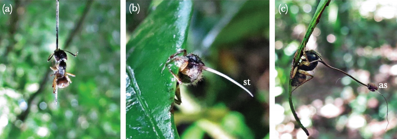

```{r setup, include=FALSE}
library(learnr)
knitr::opts_chunk$set(echo = TRUE, comment = NA, fig.width = 5, fig.height = 5)


```

## Introduction: zombie ant graveyards and the problem of sampling error

Fungal parasites of insects are fascinating to biologists for many reasons, one of which is their tendency to control the behaviour of infected hosts. These fungi tend to kill those insects unfortunate enough to become infected, and they then produce infectious spores from the infected cadaver which are released into the environment. In many cases the dying insect's behaviour is completely changed in ways that increase the probability that these infectious spores will contact a new host and transmit the infection.

One of the best known examples of such behavioural manipulation comes from a genus of fungus called *Ophiocordyceps*, which infects ants in tropical forests. The dying, infected ants (so-called "zombie ants") climb up vegetation and then bite onto a leaf or a stalk. This means that the sporulating cadaver is firmly attached to the vegetation, and the height gained means that the infectious spores will rain down onto the ants foraging on the forest floor.

[]("Ophiocordyceps.png")



```{r}
dir()
```


How this behavioural manipulation works is still the subject of active research. One question that a group of scientists led by Fernando Andriolli^1^ investigated was the role of light: are the infected ants in fact moving towards the light when they climb upwards in the vegatation? To test this idea they identified a number of areas where infected ants are commonly found (known as ant "graveyards") and they shaded half of each graveyard with creens which reduced the amouont of light.  Each graveyard was monitored weekly for the appearance of new infected ants in both the shaded and unshaded areas for a period 